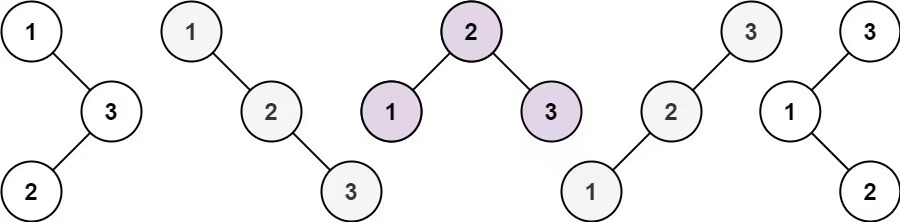

## 斐波那契数-509

### 题目描述

斐波那契数 （通常用 F(n) 表示）形成的序列称为 斐波那契数列 。该数列由 0 和 1 开始，后面的每一项数字都是前面两项数字的和。也就是：

```
F(0) = 0，F(1) = 1
F(n) = F(n - 1) + F(n - 2)，其中 n > 1
给定 n ，请计算 F(n) 。


示例 1：

输入：n = 2
输出：1
解释：F(2) = F(1) + F(0) = 1 + 0 = 1
示例 2：

输入：n = 3
输出：2
解释：F(3) = F(2) + F(1) = 1 + 1 = 2
示例 3：

输入：n = 4
输出：3
解释：F(4) = F(3) + F(2) = 2 + 1 = 3
```

### 解题思路

$F(n)$表示第n个斐波那契数，则有状态转移方程：

$$
F(n) =
\begin{cases}
0, & \text{if } n = 0 \\[6pt]
1, & \text{if } n = 1 \\[6pt]
F(n-1) + F(n-2), & \text{if } n > 1
\end{cases}
$$

```go
func fib(n int) int {
    if n == 0 {
        return 0
    }

    dp := make([]int, n+1)
    dp[0] = 0
    dp[1] = 1

    for i := 2; i < n+1; i++ {
        dp[i] = dp[i-1] + dp[i-2]
    }

    return dp[n]
}
```

## 爬楼梯-70

### 题目描述

假设你正在爬楼梯。需要 n 阶你才能到达楼顶。

每次你可以爬 1 或 2 个台阶。你有多少种不同的方法可以爬到楼顶呢？

```
示例 1：

输入：n = 2
输出：2
解释：有两种方法可以爬到楼顶。
1. 1 阶 + 1 阶
2. 2 阶
   示例 2：

输入：n = 3
输出：3
解释：有三种方法可以爬到楼顶。
1. 1 阶 + 1 阶 + 1 阶
2. 1 阶 + 2 阶
3. 2 阶 + 1 阶


提示：

1 <= n <= 45
```

### 解题思路

设$S(n)$表示爬到第n阶楼梯的方法数，n-1处，可以再爬1阶可以登顶, 有$S(n-1)$种方方式；
n-2处，可以再爬2阶也可以登顶，有$S(n-2)$种方式。因此也是斐波那契问题，状态转移方程为：

$$
S(n) =
\begin{cases}
1, & \text{if } n = 1 \\[6pt]
2, & \text{if } n = 2 \\[6pt]
S(n-1) + S(n-2), & \text{if } n > 2
\end{cases}
$$

```go
func climbStairs(n int) int {
    if n == 1 {
    return 1
    }

    dp := make([]int, n+1)
    dp[1] = 1
    dp[2] = 2

    for i := 3; i < n+1; i++ {
    dp[i] = dp[i-1] + dp[i-2]
    }

    return dp[n]
}
```

## 使用最小花费爬楼梯-746

### 题目描述

给你一个整数数组 cost ，其中 cost[i] 是从楼梯第 i 个台阶向上爬需要支付的费用。一旦你支付此费用，即可选择向上爬一个或者两个台阶。

你可以选择从下标为 0 或下标为 1 的台阶开始爬楼梯。

请你计算并返回达到楼梯顶部的最低花费。

```
示例 1：

输入：cost = [10,15,20]
输出：15
解释：你将从下标为 1 的台阶开始。
- 支付 15 ，向上爬两个台阶，到达楼梯顶部。
  总花费为 15 。

示例 2：

输入：cost = [1,100,1,1,1,100,1,1,100,1]
输出：6
解释：你将从下标为 0 的台阶开始。
- 支付 1 ，向上爬两个台阶，到达下标为 2 的台阶。
- 支付 1 ，向上爬两个台阶，到达下标为 4 的台阶。
- 支付 1 ，向上爬两个台阶，到达下标为 6 的台阶。
- 支付 1 ，向上爬一个台阶，到达下标为 7 的台阶。
- 支付 1 ，向上爬两个台阶，到达下标为 9 的台阶。
- 支付 1 ，向上爬一个台阶，到达楼梯顶部。
  总花费为 6 。


提示：

2 <= cost.length <= 1000
0 <= cost[i] <= 999
```

### 解题思路

设$S(n)$表示到达第n阶楼梯的最小花费，则可以在n-1阶楼梯处，支付`cost[n-1]`，再爬1阶到达n阶；
也可以在n-2阶楼梯处，支付`cost[n-2]`，再爬2阶到达n阶。取两者的最小值。
因此状态转移方程为：

$$
S(n) =
\begin{cases}
0, & \text{if } n = 0 \\[6pt]
0, & \text{if } n = 1 \\[6pt]
min(S(n-1) + cost[n-1], S(n-2) + cost[n-2]), & \text{if } n > 2
\end{cases}
$$

关键点：

- 可以选择从下标为 0 或下标为 1 的台阶开始爬楼梯；意味着下标为 0 或下标为 1 的台阶花费为 0。

- 下标为 len(cost) 是楼顶，而不是 len(cost)-1。所以登顶最低费用为 dp[len(cost)]。
  
  | cost | 1   | 100 | 1   | 1   | 1   | 100 | 1   | 1   | 100 | 1   | <mark>楼顶</mark> |
  | ---- | --- | --- | --- | --- | --- | --- | --- | --- | --- | --- | --------------- |
  | 下标   | 0   | 1   | 2   | 3   | 4   | 5   | 6   | 7   | 8   | 9   | 10              |
  | dp数组 | 0   | 0   | 1   | 2   | 2   | 3   | 3   | 4   | 4   | 5   | 6               |

```go
func minCostClimbingStairs(cost []int) int {
    dp := make([]int, len(cost)+1) // 第i个台阶的最小花费，i从0开始；下标 len(cost) 代表楼顶

    // 可以选择从下标为 0 或下标为 1 的台阶开始爬楼梯，意味着初始花费为 0
    dp[0] = 0
    dp[1] = 0

    for i := 2; i < len(cost)+1; i++ {
        dp[i] = min(dp[i-1]+cost[i-1], dp[i-2]+cost[i-2])
    }

    // 下标 len(cost) 代表到达楼顶
    return dp[len(cost)]
}
```

## 不同路径-62

### 题目描述

一个机器人位于一个 m x n 网格的左上角 （起始点在下图中标记为 “Start” ）。
机器人每次只能向下或者向右移动一步。机器人试图达到网格的右下角（在下图中标记为 “Finish” ）。
问总共有多少条不同的路径？


```
示例 1：

输入：m = 3, n = 7
输出：28


示例 2：

输入：m = 3, n = 2
输出：3
解释：
从左上角开始，总共有 3 条路径可以到达右下角。
1. 向右 -> 向下 -> 向下
2. 向下 -> 向下 -> 向右
3. 向下 -> 向右 -> 向下


示例 3：

输入：m = 7, n = 3
输出：28


示例 4：

输入：m = 3, n = 3
输出：6


提示：

1 <= m, n <= 100
题目数据保证答案小于等于 2 * 10^9
```

### 解题思路

设$S(m,n)$表示单元格（m, n）的不同路径数，则等于正上方单元格（m-1, n）的不同路径数向下走一步，
加上左方单元格（m, n-1）的不同路径数向右走一步。因此状态转移方程为：

$$
S(m,n) =
\begin{cases}
1, & \text{if } m = 1 \text{ or } n = 1 \\[6pt]
S(m-1,n) + S(m,n-1), & \text{if } m > 1 \text{ and } n > 1
\end{cases}
$$

关键点：

- 边界条件：第 1 行和第 1 列的单元格只有 1 条路径。
- 到某个单元格的路径数，依赖左方和正上方单元格

```go
func uniquePaths(m int, n int) int {
    // 边界条件: m = 1或者 n = 1时，只有一条路径
    table := make([][]int, m)
    for r := 0; r < m; r++ { // 构建初始表格，第一行和第一列初始化为1
        row := make([]int, n)
        if r == 0 {
            for c := 0; c < n; c++ {
                row[c] = 1
            }
            table[r] = row
            continue
        }

        row[0] = 1
        table[r] = row
    }

    for r := 1; r < m; r++ {
        for c := 1; c < n; c++ {
            // 动态规划转移方程
            table[r][c] = table[r][c-1] + table[r-1][c]
        }
    }

    return table[m-1][n-1]
}
```

## 不同路径 II-63

### 题目描述

给定一个 m x n 的整数数组 grid。一个机器人初始位于 左上角（即 grid[0][0]）。机器人尝试移动到 右下角（即 grid[m - 1][n - 1]）。机器人每次只能向下或者向右移动一步。

网格中的障碍物和空位置分别用 1 和 0 来表示。机器人的移动路径中不能包含 任何 有障碍物的方格。

返回机器人能够到达右下角的不同路径数量。

测试用例保证答案小于等于 2 * 109。

<br>
示例 1：


输入：obstacleGrid = [[0,0,0],[0,1,0],[0,0,0]]
输出：2
解释：3x3 网格的正中间有一个障碍物。
从左上角到右下角一共有 2 条不同的路径：

1. 向右 -> 向右 -> 向下 -> 向下
2. 向下 -> 向下 -> 向右 -> 向右

示例 2：


输入：obstacleGrid = [[0,1],[0,0]]
输出：1

提示：

- m == obstacleGrid.length
- n == obstacleGrid[i].length
- 1 <= m, n <= 100
- obstacleGrid[i][j] 为 0 或 1

### 解题思路

设$S(i,j)$表示单元格（i, j）的不同路径数，则等于正上方单元格（i-1, j）的不同路径数向下走一步，
加上左方单元格（i, j-1）的不同路径数向右走一步。

当单元格（i, j）存在障碍物，$S(m,n)$等于 0，此路不通。

因此状态转移方程为：

$$
S(i,j) =
\begin{cases}
0, & \text{if } obstacleGrid[i][j] = 1 \\[6pt]
1, & \text{if } m = 1 \text{ and } n = 1 \\[6pt]
S(i,j-1), & \text{if } i = 0 \text{ and } j > 0 \\[6pt]
S(i-1,j), & \text{if } i > 0 \text{ and } j = 0 \\[6pt]
S(i,j-1) + S(i-1,j), & \text{if } i > 0 \text{ and } j > 0
\end{cases}
$$

<br>
注意点：

- 当obstacleGrid[i][j] == 1表示有障碍物，此路不通，则$S(i,j) = 0$
- 临界条件：出发点有障碍物；第一行（i=0）,第一列（j=0）;

```go
func uniquePathsWithObstacles(obstacleGrid [][]int) int {
    for r := 0; r < len(obstacleGrid); r++ {
        for c := 0; c < len(obstacleGrid[0]); c++ {
            if obstacleGrid[r][c] == 1 { // 有障碍物；此路不通
                obstacleGrid[r][c] = 0
                continue
            }
            if r == 0 && c == 0 { // 出发点，且没有障碍物
                obstacleGrid[r][c] = 1
                continue
            }
            if r == 0 { // 第一行；正上方无数据，只依赖左方
                obstacleGrid[r][c] = obstacleGrid[r][c-1]
                continue
            }
            if c == 0 { // 第一列；左方没数据，只依赖上方
                obstacleGrid[r][c] = obstacleGrid[r-1][c]
                continue
            }

            // 排除以上场景，当前单元格所有不同路径
            // 1 、左方单元格，右移一步
            // 2 、上方单元格，下移一步
            obstacleGrid[r][c] = obstacleGrid[r][c-1] + obstacleGrid[r-1][c]
        }
    }

    return obstacleGrid[len(obstacleGrid)-1][len(obstacleGrid[0])-1]
}
```

## 整数拆分-343

### 题目描述

给定一个正整数 n ，将其拆分为 k 个 正整数 的和（ k >= 2 ），并使这些整数的乘积最大化。

返回 你可以获得的最大乘积 。

```
示例 1:

输入: n = 2
输出: 1
解释: 2 = 1 + 1, 1 × 1 = 1。

示例 2:

输入: n = 10
输出: 36
解释: 10 = 3 + 3 + 4, 3 × 3 × 4 = 36。


提示:

2 <= n <= 58
```

### 解题思路

S(i)表示数字 i 拆分最大乘积，将数字 i 拆分成 j 和 i-j，S(i) = S(j) * S(i-j)。

但是我们并不知道从哪里拆分 i 乘积最大，只能从 1 开始尝试。 i 拆分成 [1, i-1]和[i-1, 1]结果一致，所以只需要到i/2结束，取最大值：

```go
for i {
  maxResult := 0
  for j := 1; j <= i/2; j ++ {
    if dp[j] * dp[i-j] > maxResult {
      maxResult = dp[j] * dp[i-j]
    }
  }

  dp[i] = maxResult
}
```

j存在个别情况：j=3，此时拆分最大乘积 dp[3] = 2，不拆分最大值是 3，所以需要 max 比较一下：

```go
for i {
  maxResult := 0
  for j := 1; j <= i/2; j ++ {
    if dp[j] * dp[i-j] > maxResult {
      left := max(dp[j], j)
      right := max(dp[i-j], i-j)
      if left * right > maxResult{
        maxResult = left * right
      }
    }
  }

  dp[i] = maxResult
}
```

主体已经完成，剩下就是边界条件：dp[1] = 1, i从 2 开始遍历，自底向上填充 dp 数组。

| dp  | 0   | 1   | 1   | 2   | 4   | 6   | 9   | 12  | 18  | 27  | 36  |
| --- | --- | --- | --- | --- | --- | --- | --- | --- | --- | --- | --- |
| 下标  | 0   | 1   | 2   | 3   | 4   | 5   | 6   | 7   | 8   | 9   | 10  |

综上，转移方程：

$$
S(i) =
\begin{cases}
0 & \text{if } i = 1 \\[6pt]
1 & \text{if } i = 1 \\[6pt]
S(j) * S(i-j) & \text{if } i > 1  \text{and } j > 0  \text{ and } j <= i/2 \\[6pt]
\end{cases}
$$

```go
func integerBreak(n int) int {
    if n <= 1 {
        return 1
    }

    // d[i] 表示拆分数字 i 得到最大乘积
    // 下标和数字 i 同步，不用做-1 操作
    dp := make([]int, n+1)
    //dp[0] = 0 // 没有用到 dp[0]
    dp[1] = 1 // 初始条件

    // 最底向上，求 dp[i]
    for i := 2; i < n+1; i++ {
        maxResult := 0

    // 第一步把 i 拆分成 2 个数字，但是不知道从哪里拆，所以从 j=1 开始尝试
    // 转移方程：dp[i] = max(dp[j] * dp[i-j])
    // 另外需要注意：个别场景下，数字不拆分值更大，如：3 拆分最大乘积是 2，比自身小
        for j := 1; j <= i/2; j++ {
            left := max(dp[j], j)      // 和自身对比，不拆分可能值更大，如：j=3
            right := max(dp[i-j], i-j) // 和自身对比，不拆分可能值更大，如：j=3

            if left*right > maxResult {
                maxResult = left * right
            }
        }

        dp[i] = maxResult
    }

    return dp[n]
}
```

## 不同的二叉搜索树-96

### 题目描述

给你一个整数 n ，求恰由 n 个节点组成且节点值从 1 到 n 互不相同的 二叉搜索树 有多少种？返回满足题意的二叉搜索树的种数。

示例 1：

输入：n = 3
输出：5

<br>
示例 2：

输入：n = 1
输出：1

<br>
提示：
1 <= n <= 19

### 解题思路

> 二叉搜索树：任意一个节点，其左节点都小于该节点，右节点都大于该节点，“左小右大”的排序规则二叉树

n 等于 1和2，不同搜索树：


<br>
n 等于 3，不同搜索树：


- 根节点为 1：左边有 0 个节点；右边有 2 个节点，布局与 n=2 一致（忽略数值）。
- 根节点为 2：左右两边各一个节点，布局与 n=1 一致。
- 根节点为 3：左边有 2 个节点，布局与 n=2 一致；右边有 0 个节点。

设 dp[i] 表示i节点的不同搜索树。
所以 n=3 的所有不同搜索树：dp[3] = dp[0] * dp[2] + dp[1] * dp[1] + dp[2] * dp[0]


状态转移方程：

$$
dp(i) =
\begin{cases}
1 & \text{if } i = 0 \\[6pt]
dp(i) + dp(j-1) * dp(i-j) & \text{if } j > 0 \text{ and } j <= i \\[6pt]
\end{cases}
$$

```go
func numTrees(n int) int {
    dp := make([]int, n+1)
    dp[0] = 1

    for i := 1; i < n+1; i++ {
        for j := 1; j <= i; j++ {
            dp[i] = dp[i] + dp[j-1]*dp[i-j]
        }
    }

    return dp[n]
}
```

参考：https://github.com/youngyangyang04/leetcode-master/blob/master/problems/0096.%E4%B8%8D%E5%90%8C%E7%9A%84%E4%BA%8C%E5%8F%89%E6%90%9C%E7%B4%A2%E6%A0%91.md
