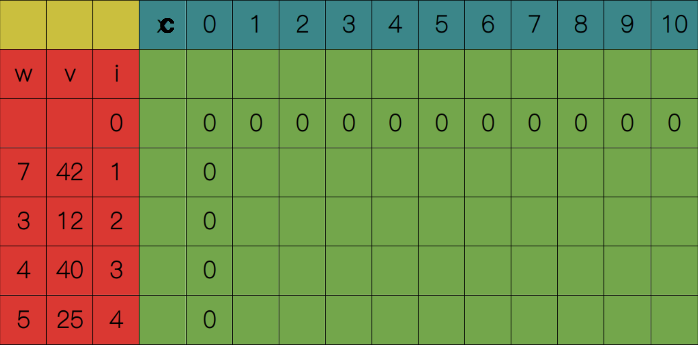
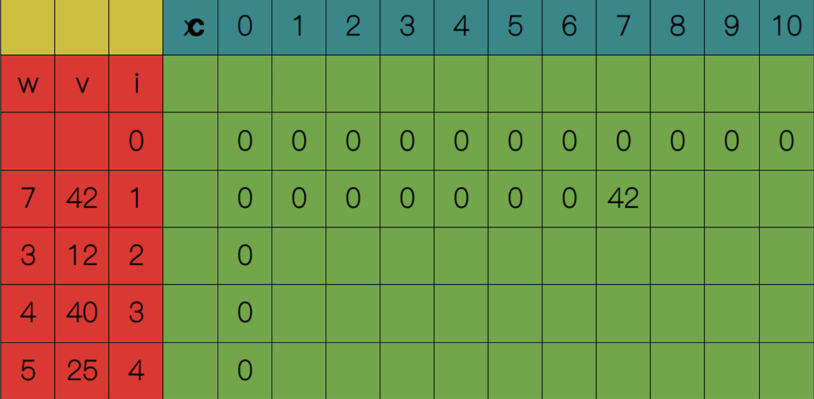
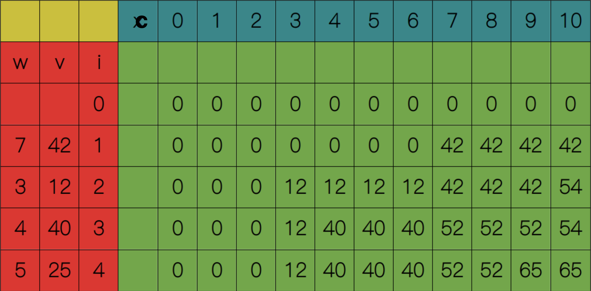
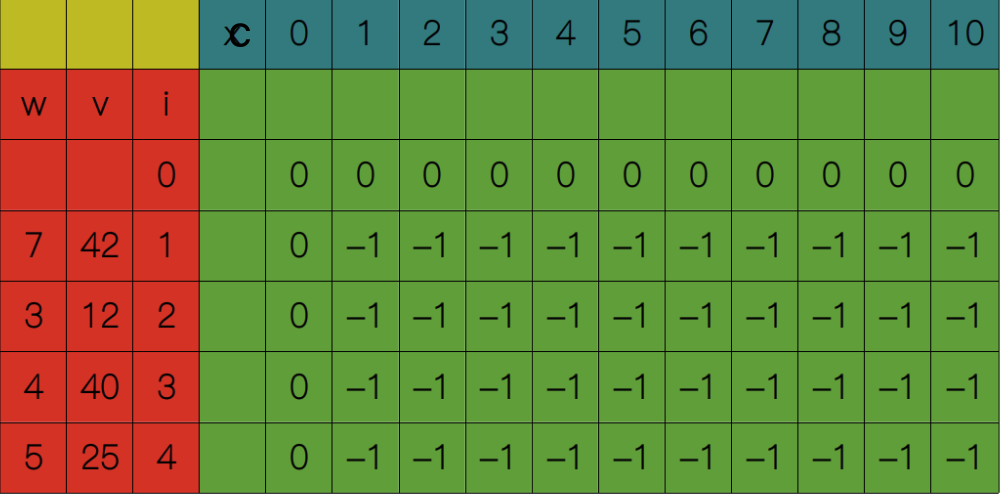
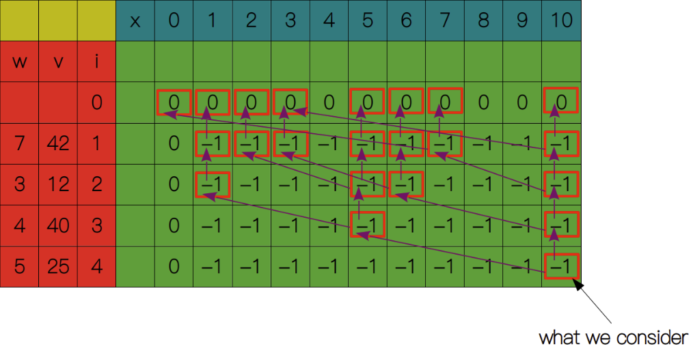
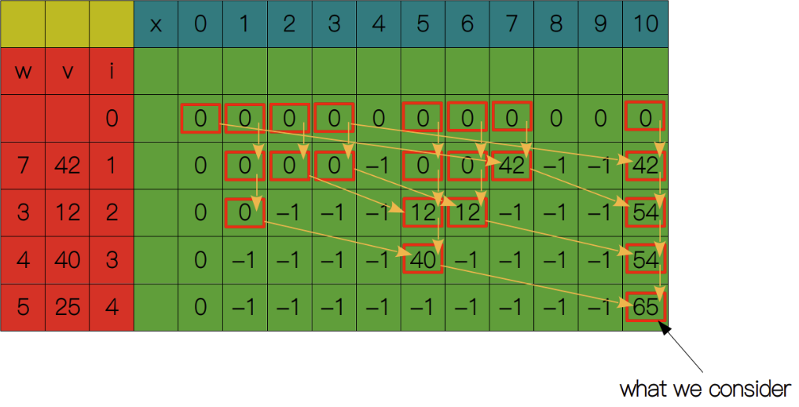
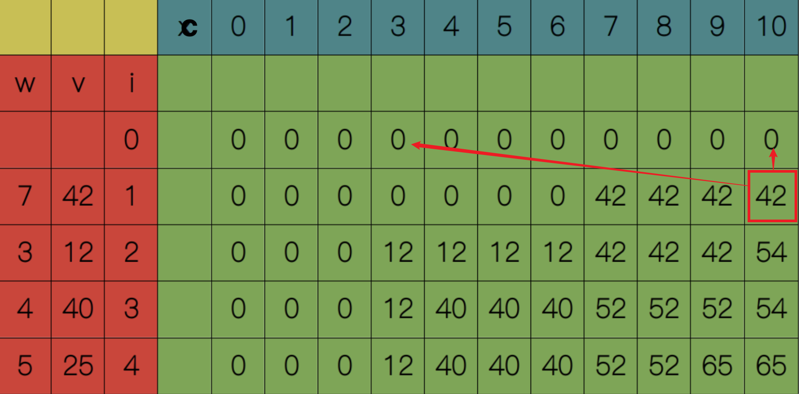
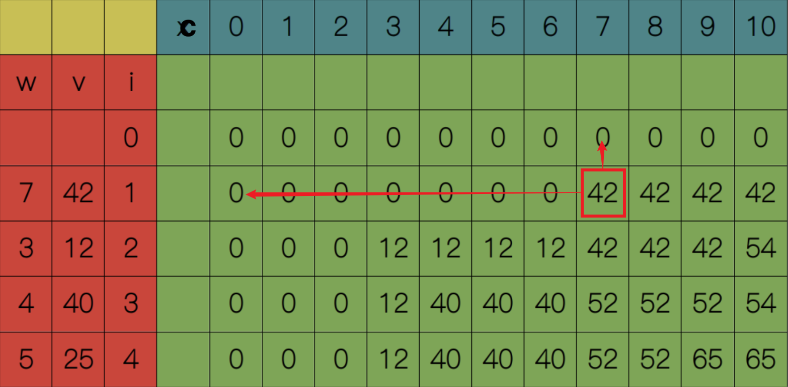

## 0-1背包问题

### 题目描述

一共有N件物品，第i（i从1开始）件物品的体积为w[i]，价值为v[i]。在总体积不超过背包上限C的情况下，能够装入背包的最大价值是多少?

如：
```
物品1: weight=7, value=42  
物品2: weight=3, value=12  
物品3: weight=4, value=40  
物品4: weight=5, value=25  

背包容量C=10; 则最大价值为:  40 + 25 = 65
```


### 解题思路

$S(i, c)$ 表示对与第 i 件物品，容量为 c 的背包，能获取的最大价值。则对于第 i 件物品，有放入和不放入两种选择：

1、不放入: 第 i 件物品重量超过背包容量，$w_i > c$。则只能选择不放入，$S(i, c) = S(i-1, c)$。

2、放入: 第 i 件物品重量不超过背包容量，$w_i \le c$。则可以选择放入，$S(i, c) = S(i-1, c - w_i) + v_i$。
$v_i$可能是负数，所以需要和不放入情况对比，取最大值。则$S(i, c) = max(S(i-1, c), s(i, c - w_i) + v_i)$

3、临界条件： 当没有物品或者背包容量为0时，最大价值为0，即$S(0, c) = 0$或$S(i, 0) = 0$。

<br/>
综上所述，状态转移方程如下：

$$
S(i, c) =
\begin{cases}
S(i-1, c), & \text{if } w_i > c \\[6pt]
S(i-1, c - w_i) + v_i, & \text{if } w_i \le c \\[6pt]
0, & \text{if } i = 0 \text{ or } c = 0
\end{cases}
$$

### 动态规划-自底向上
从解决子问题出发，逐步解决大问题。
<br/>

用一张 I * C 表格记录每个子问题的解，I表示物品数量，C表示背包容量。$S(0, c)$和$S(i, 0)$都等于0

{:height="50%" width="50%"}

<br/>

从$S(1, 1)$开始，显然$1 <= w_1$，所以$S(1, 1) = S(0, 1) = 0$。依次类推，直到$S(1, 7)$，此时$7 <= w_1$，所以$S(1, 7) = max(S(0, 7), S(0, 0) + 42) = 42$。

{:height="50%" width="50%"}

<br/>

依次类推，直到填满整张表格，最终得到$S(4, 10) = 65$。

{:height="50%" width="50%"}

<br/>

$$
S(4, 10) = max(S(3, 10), S(3, 5) + 25)
$$

通过以上分析，可以得出自底向上的代码实现如下：
```go
func knapsack_bottom_up(weights []int, values []int, capacity int) int {
	table := make([][]int, len(weights)+1, len(weights)+1)
	for j := 0; j < len(weights)+1; j++ {
		row := make([]int, capacity+1, capacity+1)
		table[j] = row
	}

	for i := 1; i < len(weights)+1; i++ {
		for c := 1; c < capacity+1; c++ {
			if weights[i-1] > c { // 不放入
				table[i][c] = table[i-1][c] // 前一个物品在该容量下的最大价值
			} else { // 放入
				table[i][c] = int(
          // table[i-1][c]是前一个物品在c容量下的最大价值，但不是一定包含 i-1 物品，需要 max 对比
					math.Max(
            // 前一个物品在该容量下的最大价值
						float64(table[i-1][c]),

            // 前一个物品在c-weights[i-1]容量下的最大价值 + 当前物品价值
            // 因为 i 从 1 开始，所以要当前物品重量weights[i-1]，价值同理
						float64(table[i-1][c-weights[i-1]]+values[i-1]), 
					),
				)
			}
		}
	}

	return table[len(weights)][capacity]
}
```
由于需要用到I * C的表格存储中间结果，空间复杂度和空间复杂度为O(IC)。

### 递归-自顶向下
着手解决原问题，先拆解成小问题，递归求解小问题，最终得到原问题的解。

对于第i个物品，要么放入，要么不放入。
```go
func main() {
	weights := []int{7, 3, 4, 5}
	values := []int{42, 12, 40, 25}
	capacity := 10

	maxValue := knapsack_recursive(weights, values, len(weights), capacity)
	fmt.Println(maxValue)
}

func knapsack_recursive(weights, values []int, i, c int) int {
	// 递归出口
	if i == 0 || c == 0 {
		return 0
	}

	if weights[i-1] > c { // 超过过容量，不放入
		return knapsack_recursive(weights, values, i-1, c)
	} else { // 放入
		return int(math.Max( // 考虑物品价值为负的场景
			float64(knapsack_recursive(weights, values, i-1, c)),
			float64(knapsack_recursive(weights, values, i-1, c-weights[i-1])+values[i-1]), // // 前一个物品在c-weights[i-1]容量下的最大价值 + 当前物品价值
		))
	}
}
```
时间复杂度$O(2^n)$：没个物品都有两种选择：放入和不放入，是一颗完全二叉树，深度为n，总共有$2^n$个节点
<br>
空间复杂度$O(n)$：递归调用栈为n

### 动态规划（备忘录）
和自低向上方式一样，先初始化一个I * C表格，每个单元格赋值-1
{:height="70%" width="70%"}
<br>

从$S(4,10)$开始，$S(4,10) = max(S(3,10), S(3, 5) + 25)$; $S(3,10) = max(S(2,10), S(2, 6) + 40)$, 以此递归，到递归出口$S(0,c) = 0$ 和 $S(i,0) = 0$。其中单元格不为-1，说明已经计算过，直接复用计算结果即可
{:height="70%" width="70%"}

递归返回
{:height="80%" width="80%"}

通过以上分析，自顶向下代码实现：
```go
func main() {
	weights := []int{7, 3, 4, 5}
	values := []int{42, 12, 40, 25}
	capacity := 10

	table := make([][]int, len(weights)+1, len(weights)+1)
	table[0] = make([]int, capacity+1, capacity+1)
	for j := 1; j < len(weights)+1; j++ {
		row := make([]int, capacity+1, capacity+1)
		for c := 1; c < capacity+1; c++ {
			row[c] = -1
		}

		table[j] = row
	}

	maxValue := knapsack_top_down(table, weights, values, len(weights), capacity)
	fmt.Println(maxValue)
}

func knapsack_top_down(table [][]int, weights, values []int, i, c int) int {
	if table[i][c] < 0 {
		if weights[i-1] > c { // 不放入
			table[i][c] = knapsack_top_down(table, weights, values, i-1, c) // 前一个物品在c容量下的最大价值
		} else {
			table[i][c] = int(math.Max( // 考虑物品价值为负数场景
				float64(knapsack_top_down(table, weights, values, i-1, c)),
				float64(knapsack_top_down(table, weights, values, i-1, c-weights[i-1])+values[i-1]), // 前一个物品在c-weights[i-1]的最大价值 + 当前物品价值
			))
		}
	}
	return table[i][c]
}
```
时间复杂度O(I * C)：因为使用备忘录，每个字问题最多被计算一次，最多有I * C个子问题
<br>
空间复杂度O(I * C)：使用二维数组备忘录保存字问题处理结果，最多有I * C个子问题

### 优化空间-滚动数组
观察状态转移方程可知，计算$S(i, c)$时，只依赖于第 i-1 行正上方：$S(i-1, c)$和左上方：$S(i-1, c-w_i)$，所以只需要保存前一行数据即可。
而且计算当前行时，需要倒序遍历容量c，防止覆盖前一行数据。

{:height="70%" width="70%"}

```go
func main() {
	weights := []int{7, 3, 4, 5}
	values := []int{42, 12, 40, 25}
	capacity := 10

	result := knapsackOptimizedSpace(weights, values, capacity)
	println("Maximum value in Knapsack =", result)
}

// 从二维表计算流程理解：计算第 i 行，第 c 列的值时，只需要用到第 i-1 行正上方和左上方值
func knapsackOptimizedSpace(weights []int, values []int, capacity int) int {
	dp := make([]int, capacity+1)
	for i := 1; i < len(weights)+1; i++ {
		for c := capacity; c > 0; c-- {
			if c > weights[i-1] { // 数组不越界
				dp[c] = int(math.Max(
					float64(dp[c]),                          // 第 i-1 行，正上方
					float64(dp[c-weights[i-1]]+values[i-1]), // 第 i-1 行，左上方；因为 i 从 1 开始，所以要减 1
				))
			}
		}
	}

	return dp[capacity]
}
```

## 完全背包问题

### 题目描述
一共有N件物品，第i（i从1开始）件物品的体积为w[i]，价值为v[i]。**每个物品可以重复选取**。在总体积不超过背包上限C的情况下，能够装入背包的最大价值是多少?

如：
```
物品1: weight=7, value=42  
物品2: weight=3, value=12  
物品3: weight=4, value=40  
物品4: weight=5, value=25  

背包容量C=10; 则最大价值为:  40 + 40 = 80
```

与0-1背包问题的区别在于，每个物品可以重复选取。

### 解题思路

与0-1背包问题类似，$S(i, c)$ 表示对与第 i 件物品，容量为 c 的背包，能获取的最大价值。则对于第 i 件物品，有放入和不放入两种选择：

1、不放入：与 0-1  背包问题相同，$S(i, c) = S(i-1, c)$

2、放入：由于物品可以重复选取，放入后，仍然可以选择放入该物品，$S(i, c) = S(i, c - w_i) + v_i$。同样需要和不放入情况对比，取最大值。则$S(i, c) = max(S(i-1, c), s(i, c - w_i) + v_i)$

<br/>
综上所述，状态转移方程如下：

$$
S(i, c) =
\begin{cases}
S(i-1, c), & \text{if } w_i > c \\[6pt]
S(i, c - w_i) + v_i, & \text{if } w_i \le c \\[6pt]
0, & \text{if } i = 0 \text{ or } c = 0
\end{cases}
$$

> 与 0-1 背包问题只有一个区别：放入物品时，状态转移方程中，$S(i-1, c - w_i)$ 变为 $S(i, c - w_i)$。

### 动态规划-自底向上
```go
func main() {
	weights := []int{7, 3, 4, 5}
	values := []int{42, 12, 40, 25}
	capacity := 10

	result := unboundedKnapsackDP(weights, values, capacity)
	println("Maximum value in Knapsack =", result)
}

func unboundedKnapsackDP(weights []int, values []int, capacity int) int {
	dp := make([][]int, 0, len(weights)+1)
	for i := 0; i < len(weights)+1; i++ {
		row := make([]int, capacity+1)
		dp = append(dp, row)
	}

	for i := 1; i < len(weights)+1; i++ { // 遍历物品(列)，从 1 开始
		for c := 1; c < capacity+1; c++ { // 遍历容量(行)，从 1 开始
			if weights[i-1] > c { // 当前物品重量大于容量，不能放入背包
				dp[i][c] = dp[i-1][c] // 等于上一个物品在 c 容量的价值
			} else {
				dp[i][c] = max( // 可能存在物品价值为负数，用 max 比较
					dp[i-1][c], // 若单前物品价值为负数

          // 因为物品可以多次放入，所以当前容量 c 下价值 = 当前物品在c-weights[i-1]时价值 + values[i-1]
          // 因为 i 从 1 开始；当前物品索引为 i-1
					dp[i][c-weights[i-1]]+values[i-1],
				)
			}
		}
	}

	return dp[len(weights)][capacity]
}
```
### 优化空间-滚动数组
与 0-1 背包问题不同，计算$S(i, c)$时，依赖于当前行的左侧单元格$S(i, c-w_i)$，所以需要正序遍历容量c，防止覆盖当前行数据。
{:height="70%" width="70%"}

```go
func main() {
	weights := []int{7, 3, 4, 5}
	values := []int{42, 12, 40, 25}
	capacity := 10

	result := unboundedKnapsackDPComp(weights, values, capacity)
	println("Maximum value in Knapsack =", result)
}

func unboundedKnapsackDPComp(weights []int, values []int, capacity int) int {
	dp := make([]int, capacity+1)

	for i := 1; i < len(weights)+1; i++ {
		for c := 1; c < capacity+1; c++ { // 正序
			if weights[i-1] > c { // 不放入
				continue // 也就是：dp[c] = dp[c]
			}

			dp[c] = max(
				dp[c], // 若物品价值为负数

				// 因为物品可以多次放入，所以当前容量 c 下价值 = 当前物品在c-weights[i-1]时价值 + values[i-1]
				// 因为 i 从 1 开始；当前物品索引为 i-1
				dp[c-weights[i-1]]+values[i-1],
			)
		}
	}

	return dp[capacity]
}
```

## Q&A
### 在构建动态规划表格时，为什么要从 1 开始？
在动态规划状态转移过程，`table[i][c] = table[i-1][c]`,为了避免数组越界，i和c都需要从1开始。
当然也可以从 0 开始，只不过需要在代码中增加额外的判断逻辑，处理 i=0 或 c=0 的情况。

### 0-1 背包问题和完全背包问题的在实现上区别是什么？
动态规划转移方程不同
- 0-1 背包问题放入物品时，$S(i,c) = S(i-1, c-w_i) + v_i$
- 完全背包问题放入物品时，$S(i,c) = S(i, c-w_i) + v_i$。


<br>
优化空间方式实现遍历顺序不同
- 0-1 背包问题依赖正上方（不放入）和左上方（放入），所以需要倒序遍历容量 c，防止覆盖前一行数据。
- 完全背包问题依赖正上方（不放入）和左侧（放入），所以需要正序遍历容量 c，防止覆盖当前行数据。

## 参考
- 01背包问题：https://infinityglow.github.io/study/algorithm/dynamic-programming/knapsack-problem/
- 完全背包问题：https://www.hello-algo.com/chapter_dynamic_programming/unbounded_knapsack_problem/

## 分割等和子集-416
### 题目描述
给你一个 只包含正整数 的 非空 数组 nums 。请你判断是否可以将这个数组分割成两个子集，使得两个子集的元素和相等。

```
示例 1：

输入：nums = [1,5,11,5]
输出：true
解释：数组可以分割成 [1, 5, 5] 和 [11] 。


示例 2：

输入：nums = [1,2,3,5]
输出：false
解释：数组不能分割成两个元素和相等的子集。


提示：

1 <= nums.length <= 200
1 <= nums[i] <= 100
```

```go
func canPartition(nums []int) bool {
	if len(nums) < 2 {
		return false
	}

	sum := 0
	for _, num := range nums {
		sum += num
	}
	if sum%2 != 0 {
		return false
	}
	// target（容量），获取能容纳子集数组最大值
	target := sum / 2

	// dp[i][t]标志在 t 容量时，子集数组最大值
	dp := make([][]int, len(nums)+1)
	// 第 i 行依赖第 i-1 行结果，为方便取值，初始化第一个行（i=0）为零值
	dp[0] = make([]int, target+1)

	// 外层遍历物品
	for i := 1; i < len(nums)+1; i++ {
		// 待填充行
		row := make([]int, target+1)
		// 内层遍历容量
		// t从 1 开始是为了方便下标计算，也可以从 0 开始
		for t := 1; t < target+1; t++ {
			if t-nums[i-1] >= 0 {
				// 放的下
				// 注意做 max 对比
				row[t] = max(
					dp[i-1][t],
					// 前一个 num，在 t-nums[i-1]（容量），再加上当前 num 值
					dp[i-1][t-nums[i-1]]+nums[i-1],
				)
			} else {
				// 容量不足，放不下，等于上一个num（物品）在 t（容量）下的值
				row[t] = dp[i-1][t]
			}
		}

		dp[i] = row
	}

	// 一顿操作下来，如果最大的子集只和刚好等于 target，则存在这样的子集
	return dp[len(nums)][target] == target
}
```
